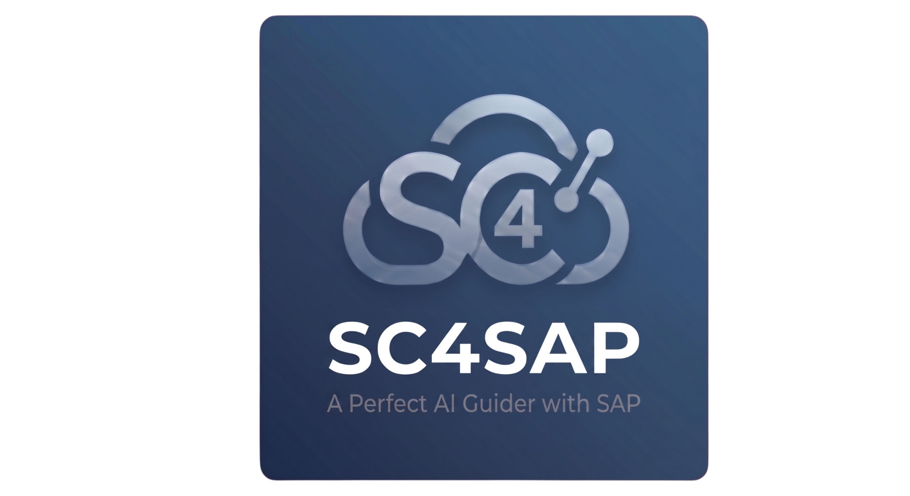

  

  English | <a href="README.ko.md">한국어</a> | <a href="README.ja.md">日本語</a> | <a href="README.de.md">Deutsch</a>

# SuperClaude for SAP (sc4sap)

> Claude Code plugin for SAP ABAP development — SAP ECC / S/4HANA On-Premise / S/4HANA Cloud (Public & Private)

## What is sc4sap?

SuperClaude for SAP transforms Claude Code into a full-stack SAP development assistant. It connects to your SAP system via the [MCP ABAP ADT server](https://github.com/babamba2/abap-mcp-adt-powerup) (150+ tools) to create, read, update, and delete ABAP objects directly — classes, function modules, reports, CDS views, Dynpro, GUI status, and more.

## Core Capabilities

| Capability | What it does |
|------------|--------------|
| 🔌 **Auto MCP Install** | `abap-mcp-adt-powerup` is auto-installed, configured, and connection-tested during `/sc4sap:setup`. No manual MCP wiring. |
| 🏗️ **Formatted Auto Program Maker** | Builds ABAP programs end-to-end: Main + conditional Includes (OOP/Procedural), full ALV + Docking, Dynpro + GUI Status, mandatory Text Elements, ABAP Unit tests — platform-aware (ECC / S4 On-Prem / Cloud). |
| 🔍 **Program Analyze** | Read any ABAP object via MCP, run Clean ABAP / performance / security review, or reverse-engineer into Functional/Technical Spec (Markdown/Excel). |
| 🧪 **Analyze Code** | `/sc4sap:analyze-code` — dedicated static review pass (`sap-code-reviewer`): Clean ABAP, performance, security, SAP standard compliance. Severity-ranked findings with concrete fix suggestions. |
| 🔀 **Compare Programs** | `/sc4sap:compare-programs` — side-by-side business comparison of 2–5 ABAP programs that share the same scenario but split by module (MM/CO), country (KR/EU), or persona (controller/warehouse). Consultant-facing Markdown report across 10 configurable dimensions. |
| 🩺 **Maintenance Diagnosis** | Operational triage loop: ST22 dumps, SM02 system messages, /IWFND/ERROR_LOG, profiler traces, logs, where-used graphs — all from Claude. |
| ♻️ **CBO Reuse (Brownfield Accelerator)** | Inventory a Z-package once — `create-program` / `program-to-spec` prefer reusing existing CBO assets over duplicates. |
| 🧷 **CBO Extension Awareness (CMOD / GGB1·2 / BAdI / APPEND)** | Inventories user-exits (CMOD), substitutions & validations (GGB1/GGB2), BAdI implementations, and APPEND structures. `create-program` / BAPI flows prefer existing Extension fields (e.g. BAPI `EXTENSIONIN` / table appends) over new CBOs; dump & incident diagnosis inspects Extension points as first-class suspects. |
| 🏭 **Industry Context** | 14 industry reference files (retail, fashion, cosmetics, tire, automotive, pharma, F&B, chemical, electronics, construction, steel, utilities, banking, public-sector). |
| 🌏 **Country / Localization** | 15 per-country files + EU-common (KR/JP/CN/US/DE/GB/FR/IT/ES/NL/BR/MX/IN/AU/SG). e-invoicing, banking, payroll, tax localization. |
| 🧩 **Active-Module Awareness** | Cross-module integration hints: MM + PS active → auto-suggest WBS fields on MM CBOs; SD + CO active → CO-PA derivation. [Details →](common/active-modules.md) |
| 🤝 **Module Consultation** | `sap-analyst` / `sap-critic` / `sap-planner` / `sap-architect` delegate to 14 module consultants + 1 BC consultant when business judgement is needed. |

## Documentation

- 📦 **[Installation & Setup →](docs/INSTALLATION.md)** — requirements, install options, wizard steps, blocklist configuration
- 🎯 **[Features Deep-Dive →](docs/FEATURES.md)** — 25 agents, 18 skills, MCP tools, RFC backends, hooks, data-extraction policy
- 📜 **[Changelog →](docs/CHANGELOG.md)** — version history and breaking changes

## Author

- **paek seunghyun** &nbsp; 

## Contributors

- **김시훈 (Kim Sihun)** &nbsp; 

## Acknowledgments

This project was inspired by [**oh-my-claudecode**](https://github.com/huryechan/oh-my-claudecode) by **허예찬 (Hur Ye-chan)**. The multi-agent orchestration patterns, Socratic deep-interview gating, persistent loop concepts, and overall plugin philosophy here all trace back to that work.

[**mcp-abap-adt**](https://github.com/fr0ster/mcp-abap-adt) by **fr0ster** was a major contribution to building our customized MCP server (`abap-mcp-adt-powerup`). The pioneering ADT-over-MCP work — request shaping, endpoint coverage, object I/O — provided the conceptual foundation we drew on while designing and extending our own server.

## License

[MIT](LICENSE)
