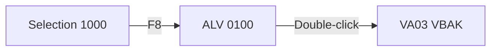

# Program → Spec — Templates

Referenced by `SKILL.md`. Use these templates in Step 4 (Render).

## Markdown — L2 Standard Spec skeleton

```markdown
# Specification: {OBJECT_NAME}

- **Type**: {Report | Class | FM | CDS | RAP BO}
- **Package**: {PKG} · **Transport (original)**: {TR}
- **Author / Changed**: {user} / {date}
- **Archetype**: {ALV report | Batch | BDC | ...}
- **Purpose (1–2 sentences)**: ...

## 1. Business Context
## 2. Data Model
| Table / CDS | Access | Key Fields | Notes |
## 3. Inputs & Screens
## 4. Main Logic (step-by-step)
## 5. Outputs
## 6. Authorizations
## 7. Exceptions & Messages
## 8. Dependencies (BAPIs, RFCs, enhancements)

### 8.1 Parameters
| Field | Type | Required | Default | Description |

(Report → `PARAMETERS` / `SELECT-OPTIONS` · FM/Class → `IMPORTING` · CDS → view params · RAP → action inputs.
 Always rendered, even when the object has no UI screens.)
### 8.2 Selection-Screen 1000 (only if screens exist)
```
┌─ Open Sales Order (ZSDR_OPEN_ORDER_ALV) ──────────────────┐
│  * Sales Organization  [____] [▼]                          │
│  * Document Date       [__________] to [__________] [▼]    │
│    Sold-to Party       [__________] to [__________] [▼]    │
│    Only open items     [X]                                 │
└────────────────────────────────────────────────────────────┘
  [F8 Execute]  [F3 Back]  [Shift+F1 Variant]
```
### 8.3 Output — ALV 0100 (only if ALV/Dynpro output exists)
```
┌──────────┬──────────┬────────────┬──────────┬────────┬──────────┐
│ SalesOrd │ Item     │ Material   │ Qty      │ UoM    │ NetValue │
├──────────┼──────────┼────────────┼──────────┼────────┼──────────┤
│ 0000012… │ 000010   │ MAT-001    │   10.000 │ EA     │  1,200.00│
└──────────┴──────────┴────────────┴──────────┴────────┴──────────┘
```
### 8.4 Screen-flow (only if multi-screen)

## 9. Open Questions / Assumptions
```

## Excel — sheet naming convention

Sheets named in chosen language; example labels (English):
`Overview`, `Inputs & Screens`, `Data Model`, `Processing Logic`, `Output`, `Authorizations`, `Exceptions`, `Enhancement Points`, `Where-Used`, `Dependent Objects`, `Risk & PII`.

The `Inputs & Screens` sheet (v8) is laid out top→bottom as: (1) sheet title, (2) Selection-Screen PNG anchored at B3, (3) ALV layout PNG anchored at B19 (≤ 3 sample rows, max 5), (4) Flow diagram, (5) BAPI / Action mapping, (6) Parameters table (`paramsBlock()` — datatype / required / default / description — always rendered), (7) yellow warning rows at the BOTTOM (Auth caveats + Data-volume caveats, style 20). Images are produced by `scripts/spec/screen-image-renderer.mjs` and embedded via `build({ images })`. Colors: grey + yellow only — green fill is retired. When no headless browser is available, degrade to cell-border wireframes via the `screen*` helpers in `rich-xlsx-template.mjs` — never silently omit the screens.
