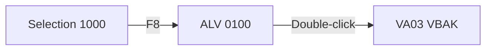

# Program → Spec — Templates

Referenced by `SKILL.md`. Use these templates in Step 4 (Render).

## Markdown — L2 Standard Spec skeleton

```markdown
# Specification: {OBJECT_NAME}

- **Type**: {Report | Class | FM | CDS | RAP BO}
- **Package**: {PKG} · **Transport (original)**: {TR}
- **Author / Changed**: {user} / {date}
- **Archetype**: {ALV report | Batch | BDC | ...}
- **Purpose (1–2 sentences)**: ...

## 1. Business Context
## 2. Inputs — Selection Screen / Importing Parameters
| Field | Type | Required | Default | Description |
## 3. Data Model
| Table / CDS | Access | Key Fields | Notes |
## 4. Main Logic (step-by-step)
## 5. Outputs
## 6. Authorizations
## 7. Exceptions & Messages
## 8. Dependencies (BAPIs, RFCs, enhancements)
## 9. Screens (wireframes)
### 9.1 Selection-Screen 1000
```
┌─ Open Sales Order (ZSDR_OPEN_ORDER_ALV) ──────────────────┐
│  * Sales Organization  [____] [▼]                          │
│  * Document Date       [__________] to [__________] [▼]    │
│    Sold-to Party       [__________] to [__________] [▼]    │
│    Only open items     [X]                                 │
└────────────────────────────────────────────────────────────┘
  [F8 Execute]  [F3 Back]  [Shift+F1 Variant]
```
### 9.2 Output — ALV 0100
```
┌──────────┬──────────┬────────────┬──────────┬────────┬──────────┐
│ SalesOrd │ Item     │ Material   │ Qty      │ UoM    │ NetValue │
├──────────┼──────────┼────────────┼──────────┼────────┼──────────┤
│ 0000012… │ 000010   │ MAT-001    │   10.000 │ EA     │  1,200.00│
└──────────┴──────────┴────────────┴──────────┴────────┴──────────┘
```
### 9.3 Screen-flow

## 10. Open Questions / Assumptions
```

## Excel — sheet naming convention

Sheets named in chosen language; examples for ko:
`개요`, `선택화면`, `데이터모델`, `처리로직`, `출력`, `권한`, `예외`, `확장점`, `어디서사용`, `부속오브젝트`, `리스크·PII`.
